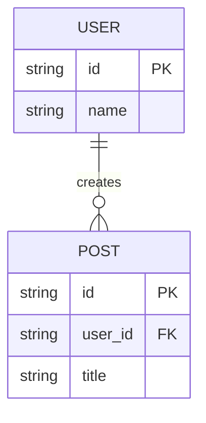

# ER図

```mermaid
erDiagram
    USER ||--o{ POST : creates
    USER {
        string id PK
        string name
    }
    POST {
        string id PK
        string user_id FK
        string title
    }
```
